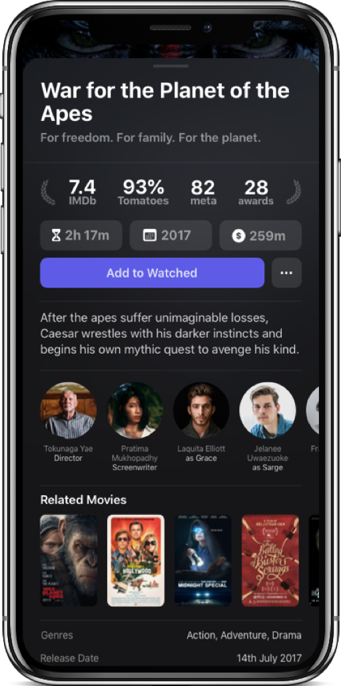
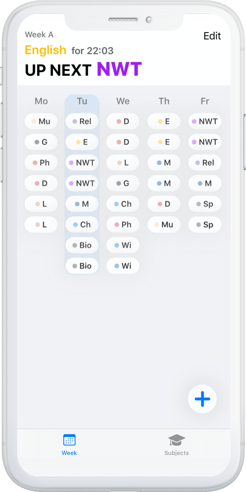
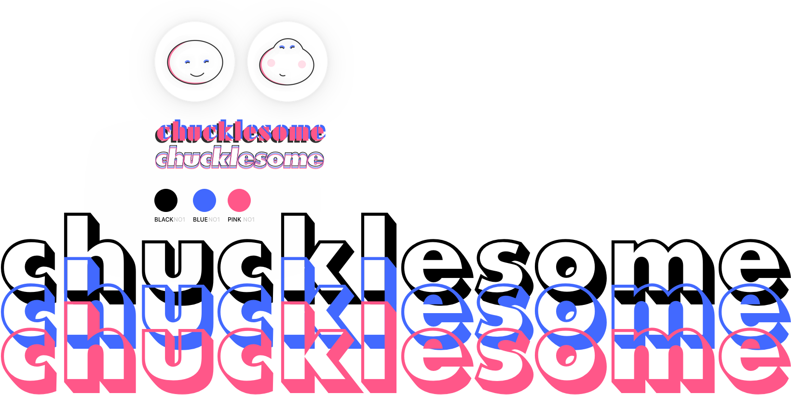

<!DOCTYPE html>
<!--  This site was created in Webflow. http://www.webflow.com  -->
<!--  Last Published: Thu Nov 21 2019 16:17:16 GMT+0000 (Coordinated Universal Time)  -->
<html data-wf-page="5dc315a8870c331421649474" data-wf-site="5dc315a8870c330020649473">
<head>
  <meta charset="utf-8">
  <title>Website Final</title>
  <meta content="width=device-width, initial-scale=1" name="viewport">
  <meta content="Webflow" name="generator">
  <link href="css/normalize.css" rel="stylesheet" type="text/css">
  <link href="css/webflow.css" rel="stylesheet" type="text/css">
  <link href="css/website-final-bc01fd.webflow.css" rel="stylesheet" type="text/css">
  
  
  <!-- [if lt IE 9]><![endif] -->
  
  <link href="images/favicon.ico" rel="shortcut icon" type="image/x-icon">
  <link href="images/webclip.png" rel="apple-touch-icon">
</head>
<body class="body">
  

    <h1 class="heading-8">15y/o creative from germany</h1>
  

  

    <h5 class="section-header">projects</h5>
    

      

        

          

            <h1 class="heading-2 showtime">Showtime</h1>
            
An app to track what you’ve watched in a detailed journal, with a unique spin on rating. Each month you get a limited amount of rating tokens, that can be spent to your liking. This way a movie rating has personal value, as opposed to a scale of 1 to 10.

          

        

      

      

      

        

          

            <h1 class="heading-2 light">Schedule</h1>
            
Have your school schedule digitalized and get live information about what subject is next and how long until then.

          

        

      

      

      

        

          <h1 class="heading-2 light abs">Chucklesome</h1>
          
An effort to create a personal brand under which I would be able to publish the aforementioned apps.

      

    

  

  

    <h5 class="section-header">Current Goals</h5>
    

      

        

          <h3 class="heading-4 larger">Drawing</h3>
          

            

              <h3 class="heading-5">2</h3>
            

            

            <h3 class="heading-10">increase to</h3>
            

            

              <h3 class="heading-5">3</h3>
            

          

        

      

      

      

      

    

    <h5 class="section-header">Skill Tree</h5>
    

      

        

          <h2 class="heading-3">F</h2>
        

        

          <h3 class="heading-4">Programming</h3>
          

            <h3 class="heading-5">3</h3>
          

        

        

          <h3 class="heading-4">Silicon</h3>
          

            <h3 class="heading-5">0</h3>
          

        

      

      

      

        

          <h2 class="heading-3">M</h2>
        

        

          <h3 class="heading-4">Story Writing</h3>
          

            <h3 class="heading-5">1</h3>
          

        

        

          <h3 class="heading-4">World Building</h3>
          

            <h3 class="heading-5">1</h3>
          

        

        

          <h3 class="heading-4">Sciences</h3>
          

            <h3 class="heading-5">2</h3>
          

        

      

      

      

        

          <h2 class="heading-3">V</h2>
        

        

          <h3 class="heading-4">Drawing</h3>
          

            <h3 class="heading-5">2</h3>
          

        

        

          <h3 class="heading-4">UI/UX</h3>
          

            <h3 class="heading-5">2</h3>
          

        

        

          <h3 class="heading-4">3D General</h3>
          

            <h3 class="heading-5">2</h3>
          

        

        

          <h3 class="heading-4">Animation</h3>
          

            <h3 class="heading-5">1</h3>
          

        

      

      

      

        

          <h2 class="heading-3">A</h2>
        

        

          <h3 class="heading-4">Music</h3>
          

            <h3 class="heading-5">1</h3>
          

        

        

          <h3 class="heading-4">Sound</h3>
          

            <h3 class="heading-5">0</h3>
          

        

      

    

    <h4 class="legend-key">Legend</h4>
    

      

        

          <h4 class="legend-key">0</h4>
        

        

          <h4 class="legend-key">1</h4>
        

        

          <h4 class="legend-key">2</h4>
        

        

          <h4 class="legend-key">3</h4>
        

      

      

        
no idea at all

        
messed around

        
basic concepts

        
&gt; 300h experience

      

    

    

      

        

          <h4 class="legend-key mono">F</h4>
        

        

          <h4 class="legend-key mono">M</h4>
        

        

          <h4 class="legend-key mono">V</h4>
        

        

          <h4 class="legend-key mono">A</h4>
        

      

      

        
function

        
mind

        
visual

        
audio

      

    

  

  

    <h5 class="section-header">brief history</h5>
    

      

        

          <h2 class="heading-6">Story Writing</h2>
          
I remember the first time I felt the joy of story writing, back in fourth grade in German class. From there on I went on to write several short stories, both personal and for school. Sadly I stopped some two years ago and couldn’t find a path back. It remains one of my biggest passions.

        

        

          <h2 class="heading-7">&#x27;14</h2>
        

      

      

        

          <h2 class="heading-6">HTML/CSS</h2>
          
I’ve spent time learning web development. In that time I created about three iterations of a personal website in raw HTML.

        

        

          <h2 class="heading-7">&#x27;16</h2>
        

      

      

        

          <h2 class="heading-6">Pixel Art</h2>
          
Through the incredibly beautiful game The Last Night I discovered the art of pixels. With few squares, you can create a piece nothing short of an “actual” drawing.

        

        

          <h2 class="heading-7">&#x27;17</h2>
        

        

      

      

        

          <h2 class="heading-6">3D</h2>
          
Not much later I got into 3D mainly through Blender. I spent an extensive amount of time learning the ins and outs, something that has proven itself worthy time and time again.

        

        

        

          <h2 class="heading-6">Animation</h2>
          
Mostly through tutorials, I touched on the amazing field that is motion graphics. It was fun doing short loops and experimenting with particles, though I barely even scratched the surface.

        

        

          <h2 class="heading-7">&#x27;18</h2>
        

      

      

        

          <h2 class="heading-6 dark">Swift</h2>
          
Most recently I covered a lot of ground regarding programming. Over the past six months, I practiced with Swift, Apple’s open-source language. It’s been the most persistent I’ve ever been, and with the recent completion of the <em>Schedule</em> app, I can finally say that I have truly finished something.

        

        

          <h2 class="heading-7">&#x27;19</h2>
        

      

    

  

  

  
  
  <!-- [if lte IE 9]><![endif] -->
</body>
</html>